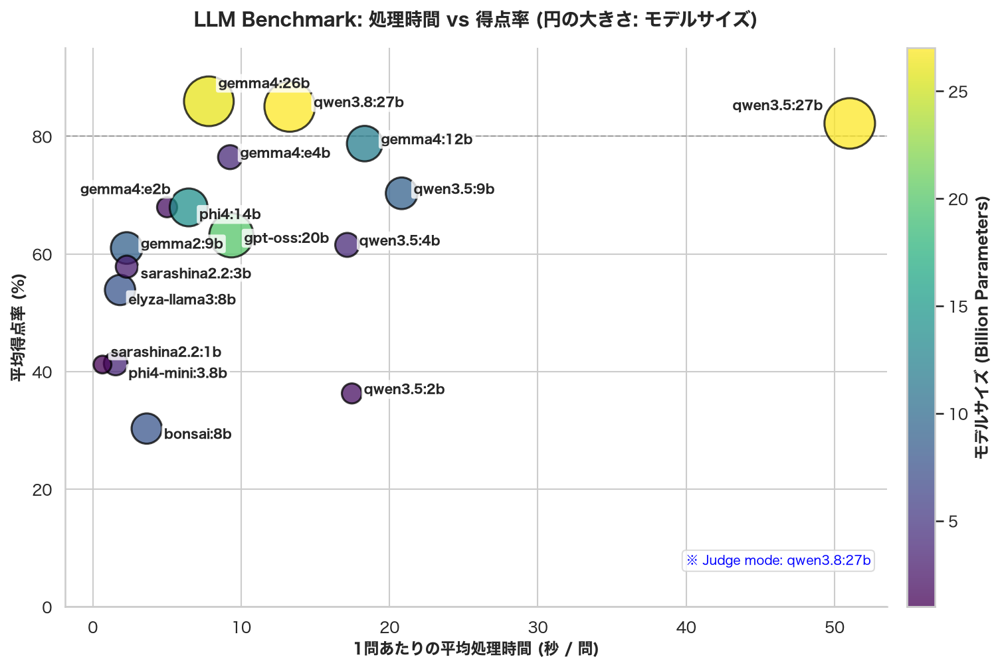
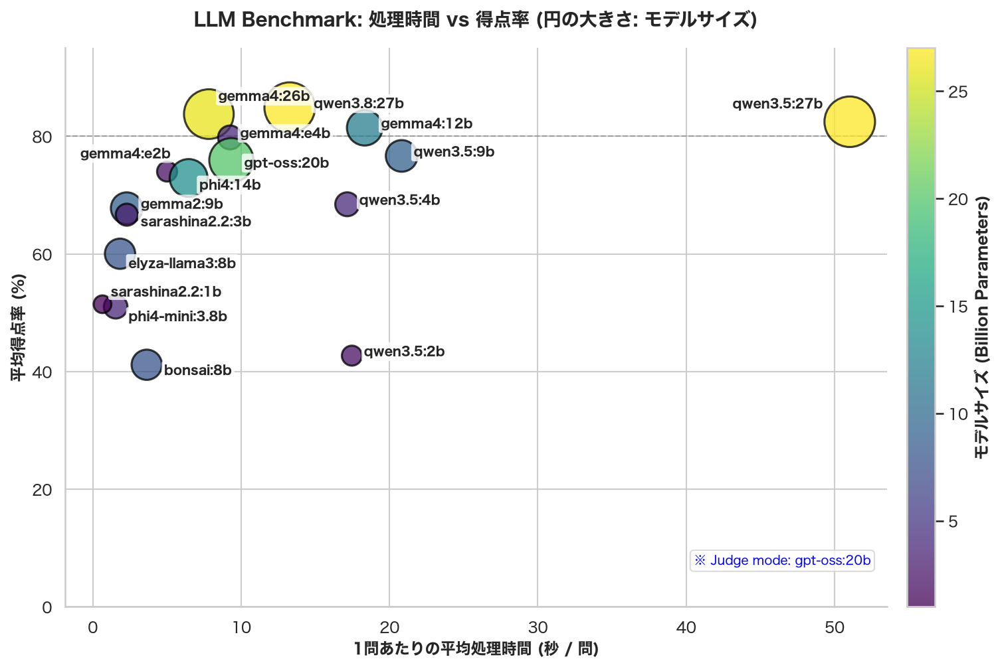

# Ollama LLM benchmark

## このフォークは

Ollamaで動くローカルLLMのベンチマークです。
ローカルで使う場合には応答時間も重要なファクターであると考え、測定しました。

## 環境

- NVIDIA RTX4090
- Ubuntu 22.04.5 LTS (Jammy Jellyfish)
- CUDA Version: 12.8
- Ollama (Docker image ollama/ollama:latest)

## 測定結果

※ 以下で説明する４つのベンチマーク試験結果の重みづけ平均のグラフになってます。

## ベンチマークの内容

- [Shaberi v2.1: A Suite of Japanese Chat Benchmarks](https://github.com/shisa-ai/shaberi)

> Shaberiベンチマークでは以下の４つのベンチマークをまとめて評価できる
> 
> - ①ElyzaのElyzaTasks100。LLMに様々なジャンルの質問して、その回答を1～5点で評価する。問題は100問。模範解答や採点基準が詳細に作り込まれている。個人的には結果を信用してるベンチマーク
> 
> - ②LightBlueのTenguBench。LLMに様々なジャンルの質問して回答を1～10点で評価する。問題は120問。模範解答はあったりなかったりする。採点基準が作り込まれてる。
> 
> - ③japanese-mt-bench-oneshot。lmsysが提供するMT-Benchを日本語化して、さらにマルチターンからシングルターン回答に簡易化させたもの。LLMに様々なカテゴリの質問して回答を1～10点で評価する。問題は60問。
> 
> - ④YuzuAIのrakuda-questions。LLMに様々なカテゴリの質問して回答を1～10点で評価する。問題は40問。
> 
> 何故これらのベンチマークが採用されてるのか？というと、LLMに自由回答させてその回答を評価する形式の日本語ベンチマークが集められてる。このようなベンチマークでなければLLMのチャット能力は測れない。LLMの喋り能力を評価できるからShaberiベンチマークというわけだ。

※ この説明は [ShaberiベンチマークでLLMを評価する](https://soysoftware.sakura.ne.jp/archives/3949)からの引用。

## 試験実行

ベンチマークの実行とグラフ作成。

0. ollama, uvをインストール。
1. `ollama pull gemma4:26b` 等で使用するモデルをインストールしておきます。
2. `nohup ./00benchmark.sh > output.log 2>&1 &` sshがキレてもバックグラウンドで実行し続けます。
3. `tail -f output.log` で進捗監視。
4. `uv run results_bubble_chart.py` でグラフ作成。

## 参考

Judge model を gpt-oss:20b にした場合。一見すると違う印象を受けますがそれぞれの相対位置はほぼ同じでした。
ただ gpt-oss:20b の自己採点結果は高い（自分に甘い）ですね。面白い！

